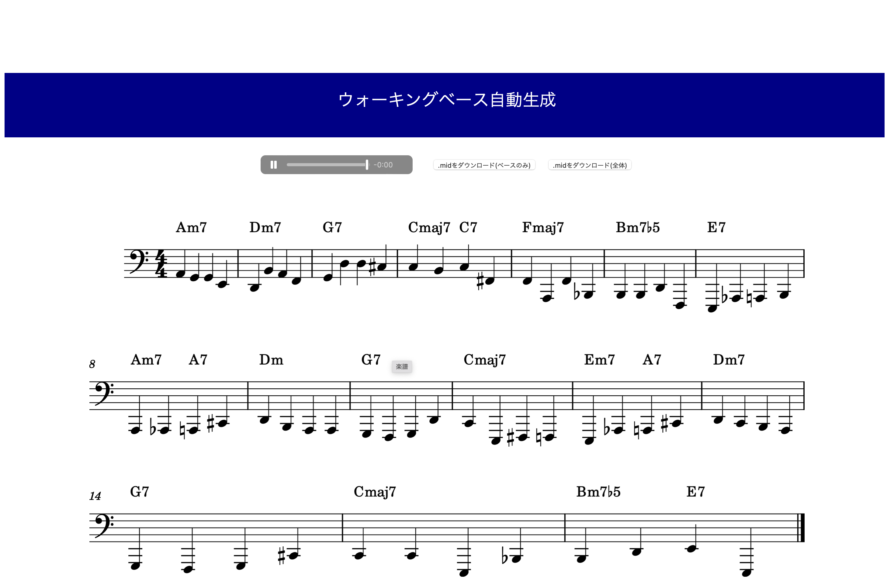

# コード進行を入力するとベースラインを出力するwebアプリ
1. `pip install -r requirements.txt`
2. `python app.py`
3. http://127.0.0.1:8000　にアクセス
4. コード進行を入力
    ```
    ex)
    Am7|Dm7|G7|CM7C7|
    FM7|Bm7b5|E7|Am7A7|
    Dm7|G7|CM7|Em7A7|
    Dm7|G7|CM7|Bmb5E7|
    ```
5. 結果が見れる(ファイルはoutputフォルダーに)
    
